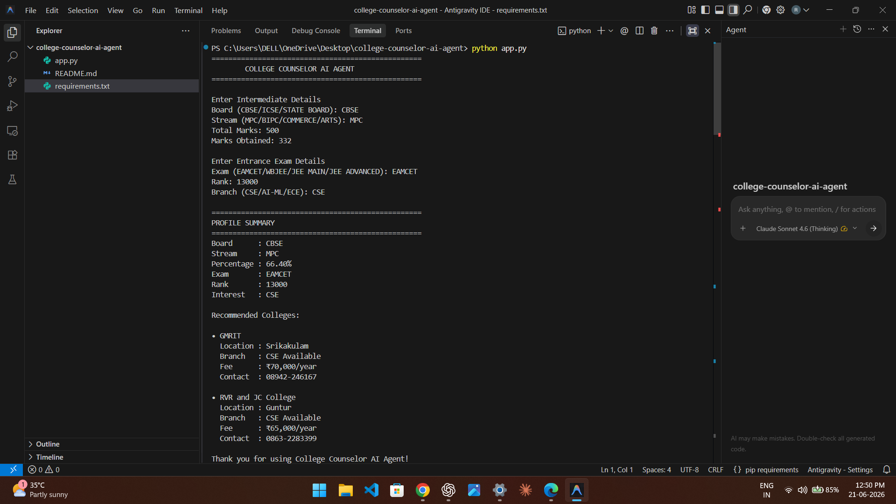
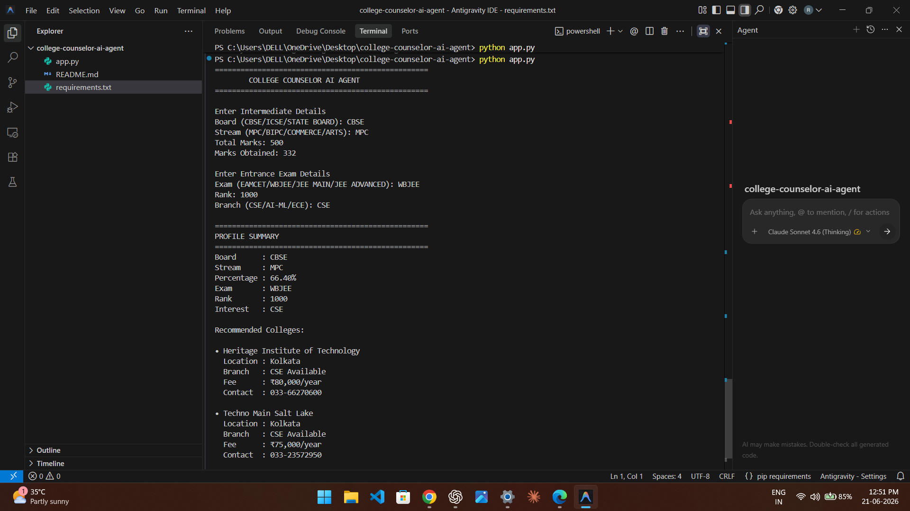
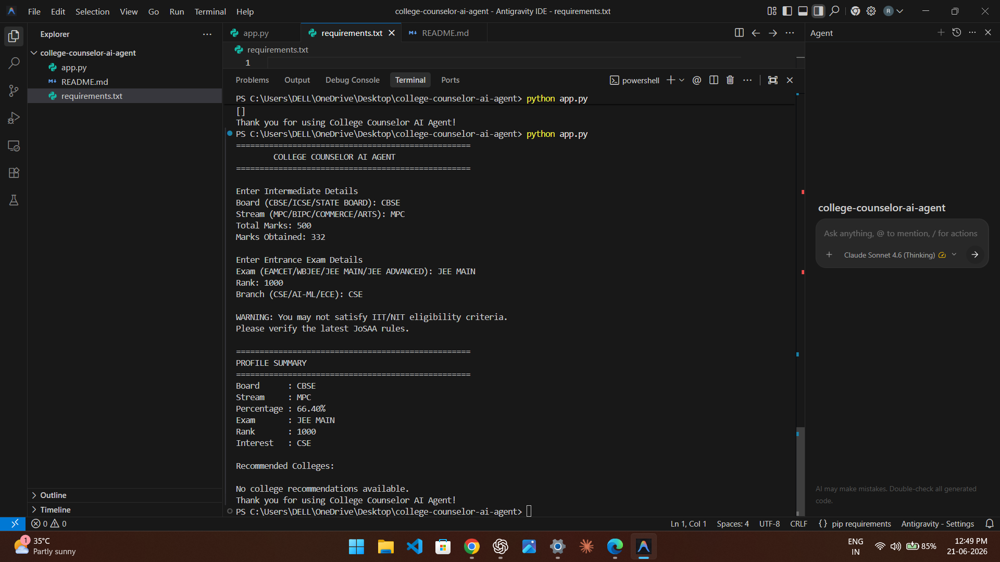
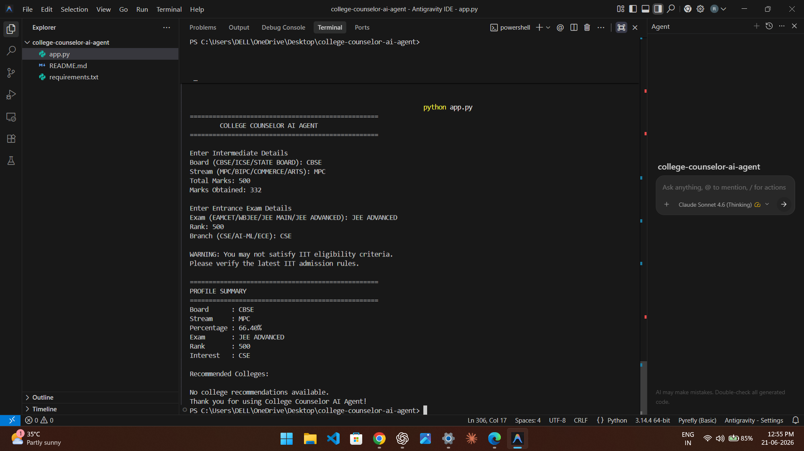

# College Counselor AI Agent

A Python-based application that recommends colleges based on entrance exam rank, board percentage, and branch preference.

## Features

- College recommendations based on rank
- Supports EAMCET, WBJEE, JEE Main, JEE Advanced
- Calculates percentage automatically
- Displays eligibility warnings
- Provides branch-specific suggestions
  
## Screenshots

### EAMCET Recommendation


### WBJEE Recommendation


### JEE Main Recommendation


### JEE Advanced Recommendation


## Technologies Used

* Python 3

## How to Run

```bash
python app.py
```

## Author

M Rohit
